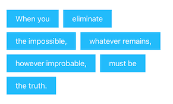

# AlignedCollectionViewFlowLayout
A collection view layout that aligns the cells left or right with a constant spacing between the cells, just like left- or right-aligned text in a document. Other than that, the layout behaves exactly like Apple's [`UICollectionViewFlowLayout`](https://developer.apple.com/reference/uikit/uicollectionviewflowlayout).

## Available Alignment Options:

* `cellAlignment = .left`

* `cellAlignment = .right`

## Usage

Add the file `AlignedCollectionViewFlowLayout.swift` to your Xcode project and you're ready to go:

### Setup in Interface Builder

1. You have a collection view in Interface Builder and setup its data source appropriately. Run the app and make sure everything works as expected (except the cell alignment).

2. In the Document Outline, select the collection view layout object.

3. In the Identity Inspector, set the layout object's custom class to `AlignedCollectionViewFlowLayout`.

4. Run your app. Your cells will now be left-aligned.

5. _(Optional)_ If you want your cells to be **right-aligned** just add the following code to your view controller's `viewDidLoad()` method:

        let alignedFlowLayout = collectionView?.collectionViewLayout as? AlignedCollectionViewFlowLayout
        alignedFlowLayout?.cellAlignment = .right

### Setup in code

1. Create a new `AlignedCollectionViewFlowLayout` object and specify the alignment you want (`.left` or `.right`):

        let alignedFlowLayout = AlignedCollectionViewFlowLayout(cellAlignment: .left)

2. Either create a new collection view object and and initialize it with `alignedFlowLayout`:

        let collectionView = UICollectionView(frame: bounds, collectionViewLayout: flowLayout)

    **or** assign `alignedFlowLayout` to the `collectionViewLayout` property of an existing collection view:

        yourExistingCollectionView.collectionViewLayout = alignedFlowLayout

3. Implement your collection view's data source.

4. Run the app.

---

### Additional configuration

`AlignedCollectionViewFlowLayout` always distributes the cells horizontally with a constant spacing which is the same for all rows. You can control the spacing with the `minimumInteritemSpacing` property.

    alignedFlowLayout.minimumInteritemSpacing = 10

Despite its name (which originates from its superclass `UICollectionViewFlowLayout`) this property doesn't describe a _minimum_ spacing but the **exact** spacing between the cells.

The vertical spacing between the lines works exactly as in `UICollectionViewFlowLayout`:

    alignedFlowLayout.minimumLineSpacing = 10

---

### Enjoy! 😎
